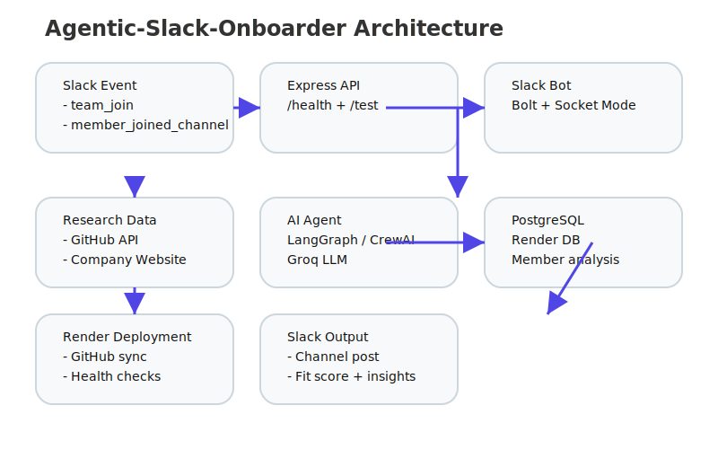

# Agentic-Slack-Onboarder

A multi-agent Slack bot that automatically scores new members based on their GitHub footprint and company background, routing them to the right channels.



## Tech Stack

- Node.js (Bolt)
- Python
- LangGraph / CrewAI
- GitHub API
- Slack API
- OpenAI / Anthropic
- PostgreSQL
- Render

## Why I Built This

Large Slack communities often suffer from generic onboarding that creates friction for new members and leaves community managers without actionable insights. `Agentic-Slack-Onboarder` solves that by combining deterministic API data collection with probabilistic LLM reasoning to generate personalized member scores, insights, and engagement recommendations.

The system enriches each new member with company and GitHub research, applies AI analysis, stores the results, and forwards the best summary directly into Slack.

## Project Overview

This project is built as an event-driven Slack bot with a lightweight Express API layer and a PostgreSQL persistence layer.

### Core capabilities

- Listens for Slack onboarding events
- Enriches member data from GitHub and company website research
- Generates personalized scoring and engagement guidance with LangGraph/CrewAI
- Writes analysis to PostgreSQL
- Posts structured insights into Slack channels

## Local Setup

### 1. Clone the repo

```bash
git clone https://github.com/mec-256/community-onboarding-agent.git
cd community-onboarding-agent
```

### 2. Install dependencies

```bash
npm install
```

### 3. Create a `.env` file

Copy the example file and fill in the values:

```bash
cp .env.example .env
```

### 4. Required environment variables

- `SLACK_BOT_TOKEN` — Slack Bot OAuth token
- `SLACK_APP_TOKEN` — Slack App-level token for Socket Mode
- `SLACK_SIGNING_SECRET` — Slack signing secret
- `SLACK_PRIVATE_CHANNEL_ID` — Slack channel ID to post analysis
- `GROQ_API_KEY` — Groq LLM API key
- `GITHUB_PAT` — GitHub Personal Access Token for user research
- `DATABASE_URL` — PostgreSQL connection string
- `COMPANY_NAME` — Company name for prompt context
- `COMPANY_PRODUCT` — Product name for prompt context
- `NODE_ENV` — `development` or `production`
- `PORT` — Port to run the Express server on

### 5. Run locally

```bash
npm start
```

### 6. Test the health endpoint

```bash
curl http://localhost:3000/health
```

You should see a JSON response like:

```json
{"status":"healthy","timestamp":"..."}
```

## Deployment

This app is designed to deploy on Render using the included `render.yaml` configuration. The service uses an existing PostgreSQL database via `DATABASE_URL` and connects secrets through Render environment variables.

## Recruiter-Friendly Summary

**Agentic-Slack-Onboarder** is a production-ready Slack onboarding assistant that uses Slack Bolt, AI reasoning, GitHub enrichment, and PostgreSQL persistence to create a personalized onboarding experience for new community members.

